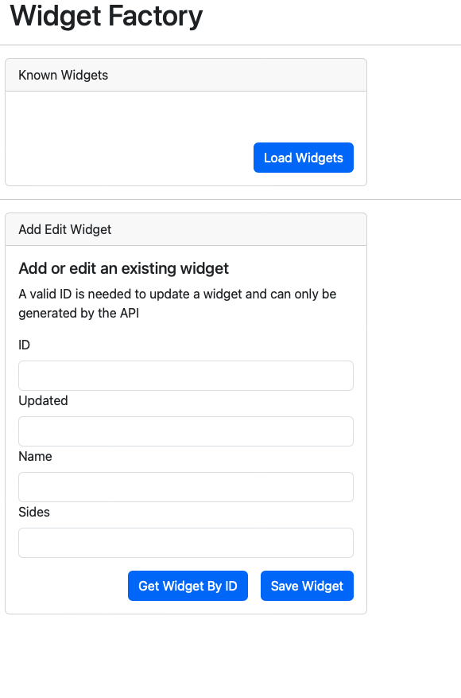
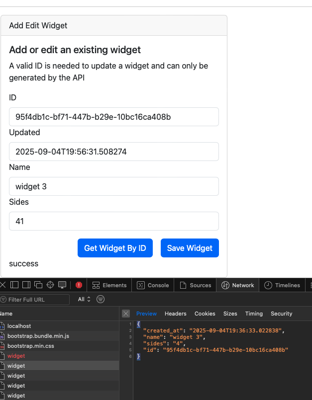
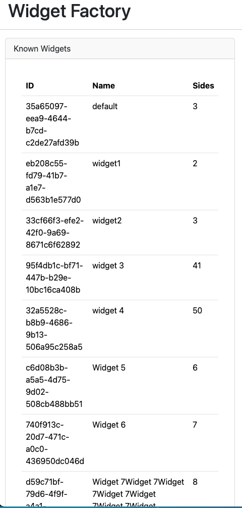
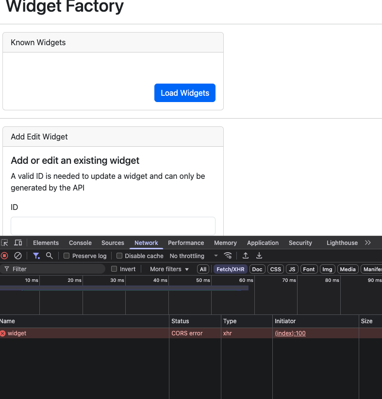

# Youssef Khalil Assessment - 09.04.2025

## Intro

To test the widget factory, I started by understanding how the API calls work and testing them to create test data.
Then I created users and widgets using the API calls and also tested fetching them and updating them. 
Then I checked the frontend application and used it to create / update the widgets and did some exploratory testing.

The below should demonstrate the types of tests that I would perform to ensure a high quality system.


## Testing strategy
### Scope
The Scope of testing for this system will cover the functionalities and performance of the Widget factory. That includes but not limited to:

#### API level
1. Verify that the API call for creating users is working after including username and password.
2. Verify that a proper error message will show in case the API call for creating a user is missing one or more of the needed credentials.
3. Verify that authenticating a user after using the right credentials is working and authentication code is returned in the response
4. Verify that a proper error message will show in case the API call for authenticating a user includes wrong credentials
5. Verify that the API call for fetching all the widgets is working while being authenticated
6. Verify that a proper error message will show in case the API call for fetching widgets does not include an authorization token
7. Verify that the API call for creating widgets is working when the needed information are added in the request (name & sides)
8. Verify that a proper error message will show in case the API call for creating a widget does not include an authorization token
9. Verify that a proper error message will show in case the call for creating widgets has the wrong values (like adding an ID)
10. Verify that the API call for fetching a specific widget using an ID will show the details of the widget
11. Verify that a proper error message will show in case of entering the wrong ID while fetching a widget 
12. Verify that a proper error message will show in case the API call for fetching a specific widgets does not include an authorization token
13. Verify that the API call for updating a specific widget will only work in case there's an authorization token
14. Verify that the API call for updating a specific budget will only work in case the ID is valid
15. Verify that a proper error message will show in case the API call for updating a specific widget does not include a valid ID

#### UI / Frontend Level
1. Verify that the user can login and the user is redirected correctly
2. Verify that if in case the user doesn't enter the correct credentials, they will see a proper error message
3. Verify that in case there are existing widgets, they will be loaded automatically when the user logs in
4. Verify that the widget table will be shown properly, even if the name of the widget is too long
5. Verify that a widget will be created in case the user added a name and sides and saved it
6. Verify that the user can get a widget displayed in the Add Edit Widget section if they added a valid ID and pressed Get by ID
7. Verify that the user can update a widget after changing either the name or the side fields and pressed Save
8. Verify that pressing load widgets after updating a widget will show the updated info


#### Testing approach
Manual testing will be used mainly for the initial release.
After the release, automated testing will be created for the **major** user journeys.
Testing can start **as soon as** enough parts of the user journeys are implemented and deemed ready for testing.
Testing should be done in an incremental way as the product develops.
This approach will help to close the gaps between product expectations and development implementation.


#### Testing schedule
**Phase 1:**
Once the implementation is done and deployed to a staging env, a manual check over all the user flows mentioned in the scope section will be tested and verified.

**Phase 2:**
A Mob session could be scheduled with some of the team members to go through the whole feature.
This should help in revealing any unnoticed issues and also helps in expanding the testing conditions, parameters as well as usage patterns.

**Phase 3:**
Final regression testing will be executed on the impacted system areas before the announcement of the release to the outside users on the production environment.

#### Testing environment
Staging / Production

#### Entry criteria
Feature integration
Deployment to a Staging Env
Test data / credentials are created


#### Exit criteria
Critical bugs are communicated.
Any fixed critical bugs are retested and verified.
Regression testing is completed on Production


#### Feedback on API
- Creating a widget with no data still creates an item in the database which could stress the system and jeopardise the quality of the data in the future in case it's automated. (Recommend making the name / sides values mandatory)


#### Feedback on UI
- Showing success and error messages with corresponding colours like green or red

- Loading the Known widgets after logging in will be a better UX for the users

- Disabling the updated field in the add Edit a widget section to ensure that users do not mess with that data

- Ensure that the name and the sides fields have some constraints ( name field could have max number of characters while sides could only include numbers)
- Allow scrolling in the known widgets section so that the page does not extend indefinitely and the user can access the add edit widget without scrolling a lot

- Same as in the API level, we could making sure that the name and the sides fields are mandatory in order not to jeopardise that quality of the data
- Making sure that CORS issues won't occur to outside users



#### Performance / Scalability
We can also perform performance testing using tools like Artillery which will allow us to test certain requests in case we anticipate a lot of load on them.
We can also use the Chrome lighthouse tool to check the score of the UI pages to assess the performance and check if there are any bottlenecks


---

To be honest, the next section was done after the 2 hours limit but I wanted to demostrate how I would automate the cruical parts using playwright.

Below, I will share how I created the solutions for it including the necessary steps for a smooth re-run on other machines.

For starters, I would like to state which stack I decided to use for this:
- Code Editor: Visual Studio Code 
- Framework: Playwright
- Language: TypeScript

# Installations dependencies

- Run the latest docker image

- If you don't have the Playwright installed, then please go to the Extensions Marketplace tab on VSC , Search for Playwright and install **'Playwright Test for VSCode'**. 
- Press install to setup the VS Code extension.
- Once installed, open the command panel and type:

  ```>Install Playwright```

- Confirm the installation by selecting the browsers you wish to have supported.

- For more info about the Playwright installation , please refer to [official playwright documentation link](https://playwright.dev/docs/intro).

# Running the tests
- There are 2 ways to run the tests with playwright. 

    In order to visually see how the test is running, please use the following command in the Terminal and press play for the test to run

    ``` npx playwright test --ui ```

    In order to run the test using headless mode, please use the following command in the Terminal
    
    ``` npx playwright test --workers=1 --project=chromium```

The tests are covering 2 ways of creating widgets: 

A.  [api-create-widget](tests/api-create-widget.spec.ts) automates the test of creating a widget via API requests by:

    1. Creating a new user
    2. Authenticating the user
    3. Creating a new widget


   
B.  [ui-create-widget](tests/ui-create-widget.spec.ts) automates the test of creating a widget via the frontend application by

    1. Creating a new user via API
    2. Logging in with the user
    3. Filling the section of adding a new widget
    4. Loading the widgets and verifying that the new one is displayed